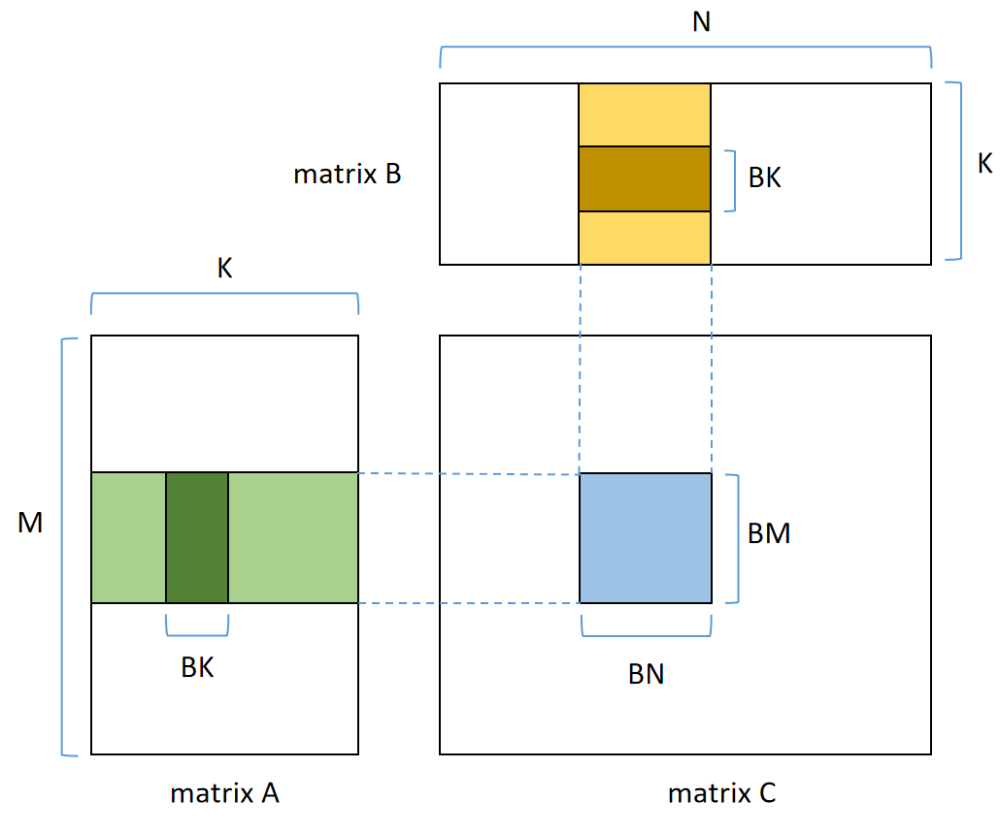
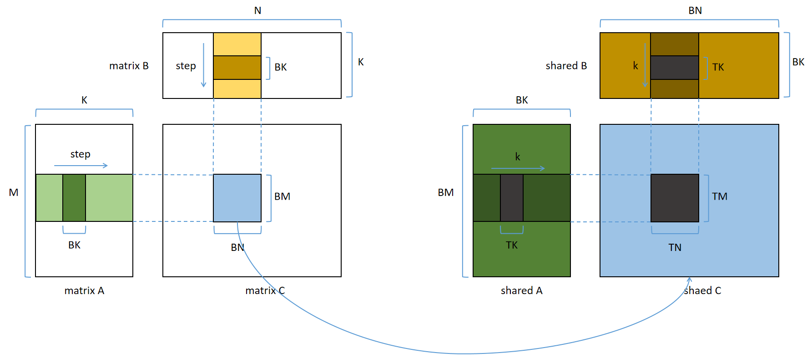
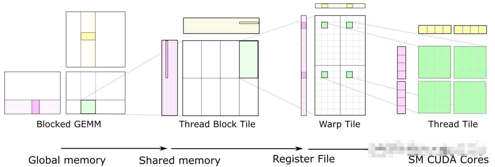

# SGEMM优化详解之步步登仙
通用矩阵乘法（General Matrix Multiplicatio，GEMM）的优化几乎是学习CUDA的必经之路。本人在学习的过程中，查阅了很多相关资料，反复琢磨，终于算是对其优化的技术和具体代码实现有所了解，深感其中不易。很多资料没有代码，或者只给出最终代码，导致理解难度较大。因此本文将详细介绍每一步优化的方法，及其代码实现。一共六个版本的代码，每个版本都是在前一版的基础上做的优化，让初学者能够一步一步去理解，而不是一股脑的给出最终代码。  
本文的代码见 https://github.com/li199603/sgemm_with_cuda  
修仙的过程没有一蹴而就，需层层参透才能步步进阶，祝各位道友早日登仙。按本文的进阶步伐，配合RTX 3060法器，可修炼到如下境界。   
```text
--------------------------------- M= 1024, N= 1024, K= 1024 ---------------------------------
sgemm_cublas: total_time=   2.542ms, kernel_time=   0.323ms, tflops= 6.643
sgemm_gpu_v1: total_time=   4.702ms, kernel_time=   2.888ms, tflops= 0.744
sgemm_gpu_v2: total_time=   3.645ms, kernel_time=   1.904ms, tflops= 1.128
sgemm_gpu_v3: total_time=   2.326ms, kernel_time=   0.622ms, tflops= 3.453
sgemm_gpu_v4: total_time=   2.196ms, kernel_time=   0.488ms, tflops= 4.400
sgemm_gpu_v5: total_time=   2.233ms, kernel_time=   0.498ms, tflops= 4.311
sgemm_gpu_v6: total_time=   2.156ms, kernel_time=   0.445ms, tflops= 4.828

--------------------------------- M= 8192, N= 8192, K= 1024 ---------------------------------
sgemm_cublas: total_time=  57.600ms, kernel_time=  14.169ms, tflops= 9.700
sgemm_gpu_v1: total_time= 204.762ms, kernel_time= 162.294ms, tflops= 0.847
sgemm_gpu_v2: total_time= 151.949ms, kernel_time= 108.982ms, tflops= 1.261
sgemm_gpu_v3: total_time=  69.521ms, kernel_time=  27.200ms, tflops= 5.053
sgemm_gpu_v4: total_time=  61.580ms, kernel_time=  19.241ms, tflops= 7.143
sgemm_gpu_v5: total_time=  60.130ms, kernel_time=  17.674ms, tflops= 7.776
sgemm_gpu_v6: total_time=  59.584ms, kernel_time=  17.118ms, tflops= 8.029

--------------------------------- M=12288, N=12288, K= 1024 ---------------------------------
sgemm_cublas: total_time= 129.397ms, kernel_time=  38.266ms, tflops= 8.081
sgemm_gpu_v1: total_time= 460.233ms, kernel_time= 371.413ms, tflops= 0.833
sgemm_gpu_v2: total_time= 339.122ms, kernel_time= 249.678ms, tflops= 1.239
sgemm_gpu_v3: total_time= 149.700ms, kernel_time=  61.371ms, tflops= 5.039
sgemm_gpu_v4: total_time= 132.149ms, kernel_time=  43.667ms, tflops= 7.082
sgemm_gpu_v5: total_time= 128.724ms, kernel_time=  40.142ms, tflops= 7.704
sgemm_gpu_v6: total_time= 128.539ms, kernel_time=  38.813ms, tflops= 7.967
```  
## 炼气期——初识SGEMM
GEMM的定义为$C \leftarrow αAB + βC$，为方便讨论，本文所做的GEMM令$α=1,β=0$，即普通的矩阵乘法$C \leftarrow AB$。并且代码中的矩阵元素均为float类型，所以是SGEMM。  
设A、B、C三个矩阵的维度分别是[M, K]、[K, N]、[M, N]，在cpu上最简单的SGEMM代码如下：  
```cpp
// 完整代码见仓库源码中的函数sgemm_cpu
#define OFFSET(row, col, ld) ((row) * (ld) + (col))
for (int m = 0; m < M; m++) {
    for (int n = 0; n < N; n++) {
        float value = 0.0f;
        for (int k = 0; k < K; k++) {
            value += A[OFFSET(m, k, K)] * B[OFFSET(k, n, N)];
        }
        C[OFFSET(m, n, N)] = value;
    }
}
```  
很简单就是三层循环，C中每个元素的计算对应第三层循环，一共K次乘法和K次加法，C中一共有 M * N 个元素，所以SGEMM一共需要 2 * K * M * N 次浮点运算。  
使用CUDA编程做优化的最初起点都是先把cpu上串行的代码改写为gpu并行的。针对上面的代码，做法很简单就是每个线程对应计算C中的一个元素：  
```cpp
// 完整代码见仓库源码中的函数sgemm_gpu_v1
const int m = blockIdx.y * blockDim.y + threadIdx.y;
const int n = blockIdx.x * blockDim.x + threadIdx.x;
float value = 0.0f;
for (int k = 0; k < K; k++) {
    value += A[OFFSET(m, k, K)] * B[OFFSET(k, n, N)];
}
C[OFFSET(m, n, N)] = value;
```  
会通过并行的方法来加速运算，这是CUDA编程的开始，对应炼气期。尽管sgemm_gpu_v1相比sgemm_cpu已经快了好几个数量级，但既然都选择用CUDA来优化计算了，那怎么可能就止步于此。踏入修仙大道，谁不想步步进阶呢？  
## 筑基期——使用共享内存
决定运行速度的主要无非两点：1. 访存 2. 运算。上面的sgemm_gpu_v1运算其实没什么可以优化的，通用矩阵乘的计算就是需要这么多次乘法和加法。那就要想着优化访存，起手就要先试试加速符箓，名为“共享内存”。  
上面的sgemm_gpu_v1中，对于一个线程，它需要读取A矩阵的一行和B矩阵的一列。不考虑合并访存的情况下，一共从全局内存读取 2 * K * sizeof(float) = 8 * K 字节的数据。同样对于一个线程，其需要做 K 次乘法和 K 次加法，一共 2 * K 次浮点运算。计算访存比大概为 (2 * K) / (8 * K) = 0.25 Op/Byte。真是低得可怜。就像一个炼气期修士，在修仙界犹若蝼蚁。  
我们要想加速sgemm，就要想办法尽可能减少对全局内存的访问，全局内存的访问真的太慢了。sgemm_gpu_v1最大的问题就是有大量的对全局内存的重复访问。例如对于负责计算C[m, n]这个元素的值的线程，它与C[m, n']对应的线程都要从读取A矩阵的第m行。同理，它与C[m', n]对应的线程都要读取B矩阵的第n列。于是我们有如下图所示的改进：  
  
如上图所示，将C矩阵划分为多个 BM * BN 大小的块，每个块的结果由一个block负责计算。我们先简单点，把block的大小也设置成 BM * BN，这样还是每个线程负责一个元素。这样如果我们先把 BM * K 和 K * BN 大小的数据读到共享内存中，这样后续计算只从共享内存中读取。这个方案下一个block的计算访存比：  
计算量：$2 * K * BM * BN$  
访存量：$(BM * K + K * BN) * 4Byte$  
计算访存比：$\frac{计算量}{访存量} = \frac{1}{2(\frac{1}{BM} + \frac{1}{BN})}$  
由上式可知 BM 和 BN 越大，计算访存比越高。这本文里，此处的BM和BN都设置为16，则计算访存比为4 Op/Byte。这比sgemm_gpu_v1的0.25 Op/Byte的16倍。当然，我们不太可能把 BM * K 和 K * BN 这两块这么大的数据都一次读进共享内存，因为共享内存的大小比较有限。跟上图一样，还需要设置一个BK参数，通过循环每次读取 BM * BK 和 BK * BN 的数据进共享内存，然后计算之后再继续读取。此处的BK被设置为64，理论上BK大小不影响计算访存比。BK设置为64，这样对于一个block，BM * BN = 256 个线程，负责读取 BM * BK = 64 个float数据，平均每个线程负责4个float，刚好可以按照一个float4来读取。按float4来读取其实也是一种优化手段，具体不详细解释，这不是本文重点。  
以上就是使用共享内存优化sgemm的思路，代码见仓库源码中的函数sgemm_gpu_v2。代码逻辑还是比较好懂的，下面粗略的解释一下代码中可能不是能一眼看懂的地方，帮助大家快速理解。这不是完整代码的逻辑详解！需要先看了sgemm_gpu_v2的代码，有不好理解的地方再来看下面的部分。  
```cpp
// ***************** FETCH_FLOAT4 使用方法 *****************
// 用float4的类型读取出从float_var开始往后一共4个float的值
#define FETCH_FLOAT4(float_var) (reinterpret_cast<float4 *>(&(float_var))[0])
float a[8];
// 使用两个float4来读取a[0]和a[4]的值
float4 first_float4 = FETCH_FLOAT4(a[0]);
float4 second_float4 = FETCH_FLOAT4(a[4]);
// 使用b读取a中的后四个值
float b[4];
FETCH_FLOAT4(b[0]) = FETCH_FLOAT4(a[4]);
```  
```cpp
// ***************** 共享内存载入索引计算 *****************
const int tid = threadIdx.y * blockDim.x + threadIdx.x;
// 每次从全局内存加载到共享内存，每个线程都负责一个float4。以下是当前线程负责的这个float4的索引
const int row_s_a = tid / 16; // s_a每一行都有 BK / 4 = 16 个float4，所以除以16
const int col_s_a = (tid % 16) * 4;  // 因为float4是4个float，所以乘以4
const int row_s_b = tid / 4;
const int col_s_b = (tid % 4) * 4;
```  
## 筑基巅峰——使用寄存器
上一节我们依靠共享内存，顺利进阶筑基期。到这里有一些天资聪慧的道友会想到进一步做共享内存的bank冲突优化。但是先别着急，因为接下来的优化方法跟上一节提到的优化思路几乎一样，可以先实现。这样代码结构稳定下来再来做bank冲突优化。该方法也是一种加速符箓，而且比共享内存提供更快的内存访问速度，名为“寄存器”。  
分析sgemm_gpu_v2计算逻辑，每次循环中，我们都使用 BM * BK 和 BK * BN 两块共享内存来计算一个 BM * BN 大小的block块的值。可以发现，这实际也是一次矩阵乘法。那我们依然可以沿用上面提到的方法优化访存。上面是用共享内存加速，那这次是用寄存器加速。概括来说就是先从共享内存加载到寄存器，再做运算，示意图如下：  
  
上图中的左半部分就是图1，右半部分就是本次优化的思路。该图反应了这两个优化思路的相似性，以及在代码流程上的嵌套关系。可以看到，也是需要 BM * BN 的大block再进一步划分为 TM * TN 的小block。请注意一个小block的计算由一个线程负责。哇！有大block，又有小block！有些道友看到这里可能一下理不清怎么回事了。那我们梳理一下，本节讨论中的这几个block。  
- BM * BK 、 BK * BN 、BM * BN 以及 TM * TN 都是指的数据block
- 对于一个线程block，其负责将全局内存数据载入到 BM * BK 和 BK * BN 的共享内存数据block中，并最终计算出 BM * BN 的数据block的值
- 具体到线程block中的每个线程，其负责将共享内存数据载入到 TM * TK 和 TK * TN 的寄存器数据block中，并最终计算出 TM * TN 的数据block的值
- 最终每个线程负责最终负责计算C矩阵中 TM * TN 大小的数据block的值。而之前的sgemm_gpu_v2每个线程只负责计算一个元素的值
本节中TM * TK 、TK * TN 和 TM * TN 的数据都是存在寄存器中，而每个线程能够使用的寄存器数量是有限的。因此，此处取 TK = 1，TM = TN = 8。由于不再在是每个线程只负责计算一个元素的数据，而是负责一块 TM * TN 的数据，所以 BM 和 BN 可以适当取得更大些（上一节有结论，BM 和 BN 越大，计算访存比越高），相应的 BK 也做相应调整，取 BM = BN = 128，BK = 8。本节相关代码见函数sgemm_gpu_v3。  
## 结丹期——bank冲突优化
在筑基期我们就已经用上了名为“共享内存”的加速符箓。该符箓有一个修仙界人尽皆知的使用缺点——bank冲突。要想用出该符箓百分百的效果，还需要规避bank冲突。上面的讨论中，我们一共使用了s_a和s_b两块共享内存数组，本节我们分别优化这两块共享内存使用时的bank冲突。  
### s_a列优先
sgemm_gpu_v3的代码中，将A矩阵的全局内存数据加载到共享内存s_a中时，是没有bank冲突的。然而读s_a时，却存在bank冲突，代码如下：
```cpp
// sgemm_gpu_v3中读s_a时bank冲突代码
for (int k = 0; k < BK; k++) {
    // 从s_a加载到r_a
    const int row_start = threadIdx.y * TM;
    for (int i = 0; i < TM; i++) {
        r_a[i] = s_a[row_start + i][k];
    }
    // 从s_b加载到r_b
    ......
    // 计算
    ......
}
```  
对于在同一个warp中，在线程block的y方向相邻的两个线程，在同时执行上面的r_a[i] = s_a[row_start + i][k]时，它们分别读取的s_a的地址相差 BK * TM * sizeof(float) = 256 个字节，这一定是落在同一个bank中。这个计算公式里，需要乘BK是因为s_a是行优先排列的，这里如果将s_a改为列优先的，那么地址差 TM * sizeof(float) = 32 个字节。又由于线程block的大小是 (BM / TM, BN / TN)，即 16 * 16 的。那么每个warp中的线程在y方向是最大相差1，所以此时没有bank冲突。  
按上面的分析，将s_a改为列优先，即__shared__ float s_a[BK][BM]，具体代码见函数sgemm_gpu_v4。经过这一改动之后，从共享内存加载到寄存器的过程，每个线程读取的共享内存的地址的连续的，那就直接通过float4去读取，而不是像sgemm_gpu_v3一样是循环读取。代码如下：  
```cpp
for (int k = 0; k < BK; k++) {
    // 从s_a加载到r_a
    const int row_start = threadIdx.y * TM;
    FETCH_FLOAT4(r_a[0]) = FETCH_FLOAT4(s_a[k][row_start]);
    FETCH_FLOAT4(r_a[4]) = FETCH_FLOAT4(s_a[k][row_start + 4]);
    // 从s_b加载到r_b
    const int col_start = threadIdx.x * TN;
    FETCH_FLOAT4(r_b[0]) = FETCH_FLOAT4(s_b[k][col_start]);
    FETCH_FLOAT4(r_b[4]) = FETCH_FLOAT4(s_b[k][col_start + 4]);
    // 计算
    ......
}
```  
由于A矩阵式行优先的，而s_a则是列优先的，那么将A载入s_a中的代码需要做一点点修改，相比将B加载到s_b代码麻烦了点。代码如下：  
```cpp
for (int step = 0; step < K / BK; step++) {
    // 从A加载到s_a
    const int col_A = step * BK + col_s_a;
    const int index_A = OFFSET(row_A, col_A, K);
    FETCH_FLOAT4(r_a[0]) = FETCH_FLOAT4(A[index_A]); // 借用r_a[0]中转
    s_a[col_s_a + 0][row_s_a] = r_a[0];
    s_a[col_s_a + 1][row_s_a] = r_a[1];
    s_a[col_s_a + 2][row_s_a] = r_a[2];
    s_a[col_s_a + 3][row_s_a] = r_a[3];
    // 从B加载到s_b
    const int row_B = step * BK + row_s_b;
    const int index_B = OFFSET(row_B, col_B, N);
    FETCH_FLOAT4(s_b[row_s_b][col_s_b]) = FETCH_FLOAT4(B[index_B]);
    __syncthreads();
    ......
}
```  
虽然我们通过将s_a矩阵设置为列优先解决了读取时候的bank冲突问题，但是在上面的代码中我们反而又引入了写入时候的bank冲突。这当然可以通过padding的方式优化，不过pandding的方式并不能完全避免。要想更好的解决写时冲突，可以使用Permuted的方式，本文不涉及。  
### s_b读取位置重排
解决完s_a的bank冲突，s_b的也需要优化。同样的我们在上面的sgemm_gpu_v4的代码基础上分析。s_b的bank冲突是在读取的时候。
```cpp
// sgemm_gpu_v4中读s_a时bank冲突代码
for (int k = 0; k < BK; k++) {
    // 从s_a加载到r_a
    ...
    // 从s_b加载到r_b
    const int col_start = threadIdx.x * TN;
    FETCH_FLOAT4(r_b[0]) = FETCH_FLOAT4(s_b[k][col_start]);
    FETCH_FLOAT4(r_b[4]) = FETCH_FLOAT4(s_b[k][col_start + 4]);
    // 计算
    ...
}
```  
对于在同一个warp中，在线程block的x方向相邻的两个线程，读取s_b[k][col_start]时，相差 TN * sizeof(float) = 32 个字节，即8个bank。共享内存的一层是32个bank，也就是说每相隔 32 / 8 = 4 个线程，就会多引发一路的bank冲突。分析一个warp的在线程block中的排布可知，x方向共有16个线程，那么最多会引发4路bank冲突。由于此处是用float4读的s_b，按定义上其实发生了2路bank冲突。关于为什么是2路而不是4路，是因为几路冲突的概念是在transaction中计算的，具体可参考 https://forums.developer.nvidia.com/t/how-to-understand-the-bank-conflict-of-shared-mem/260900  
因为我们使用float4的方式读取的，上面的代码一共涉及了两次从s_b中读取，每次读一个float4。具体到一个float4的读取，如FETCH_FLOAT4(r_b[0]) = FETCH_FLOAT4(s_b[k][col_start])，可以算出一个warp中，x方向相邻的线程读取的float4之间刚好隔着一个float4。也就是说，一个warp一次的float4读取时，有些bank是没有被利用到的。于是便有了这样一个优化思路：相邻线程读取的数据尽可能相邻，尽可能利用到所有的bank，以此减少bank冲突。所以有了以下代码：  
```cpp
// 从s_b加载到r_b，v5相比v4，这里读取的位置变了
const int col_start = threadIdx.x * (TN / 2);
FETCH_FLOAT4(r_b[0]) = FETCH_FLOAT4(s_b[k][col_start]);
FETCH_FLOAT4(r_b[4]) = FETCH_FLOAT4(s_b[k][col_start + BN / 2]);
```  
可以发现，col_start的计算方法变了。这样执行FETCH_FLOAT4(s_b[k][col_start])的时候，相邻线程读取的float4在s_b中的位置是相邻的。同样的，FETCH_FLOAT4(r_b[4]) = FETCH_FLOAT4(s_b[k][col_start + BN / 2])也是相邻的。这就是本节标题所写的“s_b读取位置重排”。这种情况下，s_b中应该被读取的数据跟之前一样可是一点没落的被读取的，只不过v5相对于v4，每个线程拿到的数据的位置不一样了。但依旧可以照常用来计算r_c，只不过计算出来的r_c再存入矩阵C时，其存入位置也要做相应的偏移。本节完整代码见sgemm_gpu_v5。  
可张示意图应该更能明白这个重排是什么意思，在这里把上面提到过的所有优化方法的示意图一块给出。有些道友或许在其他地方见过，看到这应该更能理解这张图的意思了吧。  
  
上图中Warp Tile部分就是本小节所介绍的重排。图中对s_a和s_b都做了重排，而本文的sgemm_gpu_v5代码只做了s_b的。这sgemm_gpu_v5所设置的一些参数下，s_a的读取是没有bank冲突的，做了重排并不会有优化效果。不过如果 TM TN TK BM BN BK 有其他设置，考虑更通用的情况，对s_a也做重排是更合理的。  
## 结丹法宝——double buffer
步入结丹境界，怎么能没有一个趁手的法宝呢，在此为道友介绍一件名为double buffer的法宝。请注意此乃结丹期法宝，需要修炼到一定境界才能使用。原因是要使用double buffer，会极大地改变整个代码结构，最好是在其他优化方法之后再尝试。double buffer顾名思义就是把原先的buffer变成双份，像这样：  
```cpp
// 相比v5，s_a, s_b变为double buffer
__shared__ float s_a[2][BK][BM];
__shared__ float s_b[2][BK][BN];
```  
完整代码见函数sgemm_gpu_v6。当然除了共享内存可以double，寄存器也可以。本文不搞这么复杂，仅通过将共享内存double来展示这一“法宝”的使用方式。之所以把buffer变成两份，是为了通过预取来实现指令并行化。简单来说就是在一次循环中，载入的数据和计算所用的数据分在两个buffer中，这样能够实现访存的延迟隐藏。具体原理各位道友另行查阅其他资料，本文主要讲代码上如何实现。一般代码在循环中都遵循这样的结构：  
```cpp
float buffer[N];
for(int i = 0; i < NUM; i++) {
    load_data_to_buffer(buffer);
    compute(buffer);
}
```  
使用double buffer后，代码结构变为这样：  
```cpp
float buffers[2][N];
load_data_to_buffer(buffers[0]);  // 第一次加载
for (int i = 1; i < NUM; i++) {
    int load_index = i % 2;
    load_data_to_buffer(buffers[load_index]);  // 加载下一次循环需要的数据
    int compute_index = (i - 1) % 2;
    compute(buffers[compute_index]);  // 使用上一次循环加载的数据做计算
}
int compute_index = (NUM - 1) % 2;
compute(buffers[compute_index]);  // 补充最后一次加载的数据对应的计算
```  
这样一次循环中加载数据的同时可以做计算，因为该次循环计算需要的数据已经在buffer中了。  
## 仰望仙界大能
经过一步步的优化，我们的代码相比最开始的版本已经有很大的提升了，但对仙界大能来说这也不过还是一个玩具。本文为了能够更方便理解代码一步步的优化是怎么实现的，固定了一些参数，比如BN、BM、BK、TM、TN、TK，所有的分析都是建立在固定参数下的。并且也没有处理边界问题。所以不够通用。也还有很多更高阶的方法没有使用。修仙大道漫长且坎坷，还有更广阔的世界等待探索。所以推荐一些资料吧，感兴趣的道友可以自行查阅。当然最好的是看看cutlass  
https://zhuanlan.zhihu.com/p/435908830  
https://zhuanlan.zhihu.com/p/639297098  
https://github.com/NVIDIA/cutlass  
